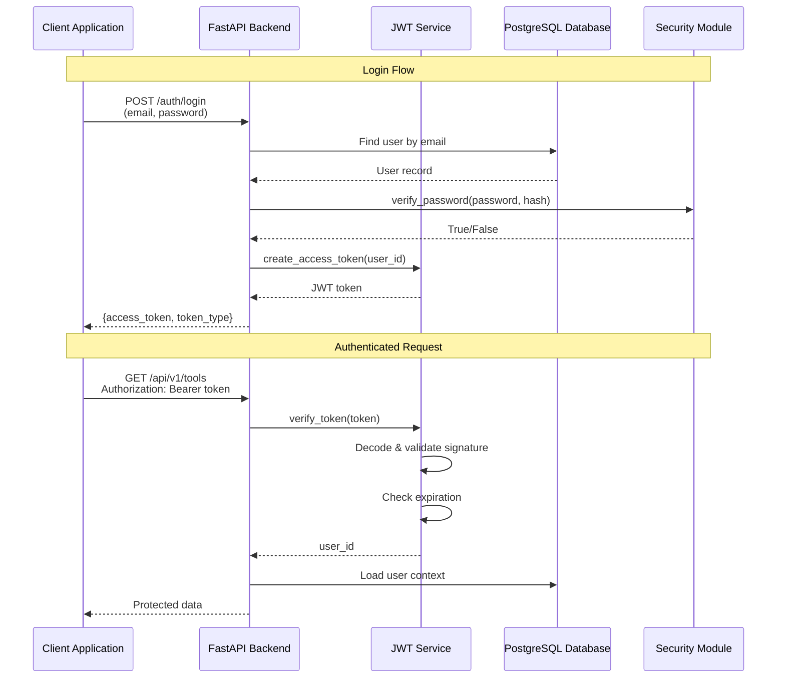
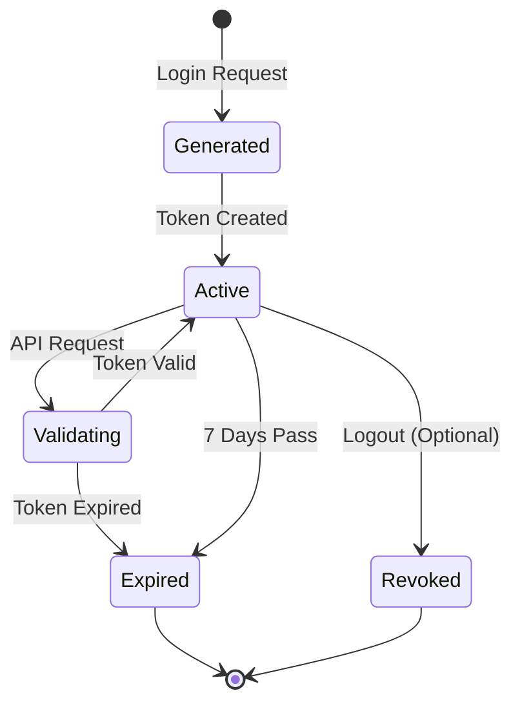
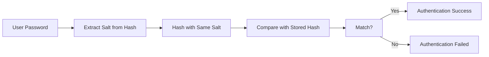
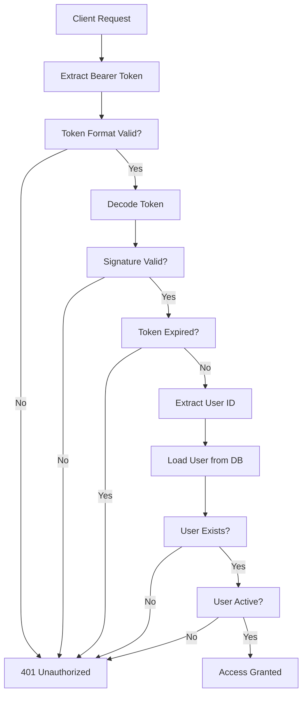
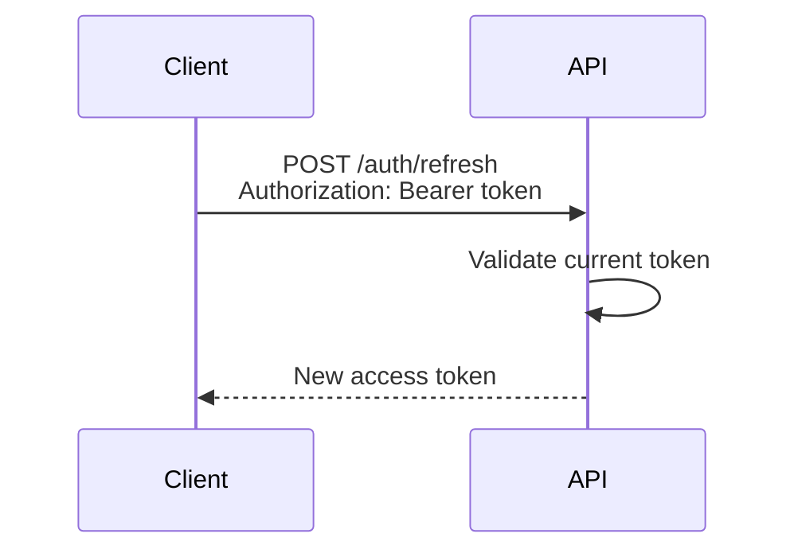
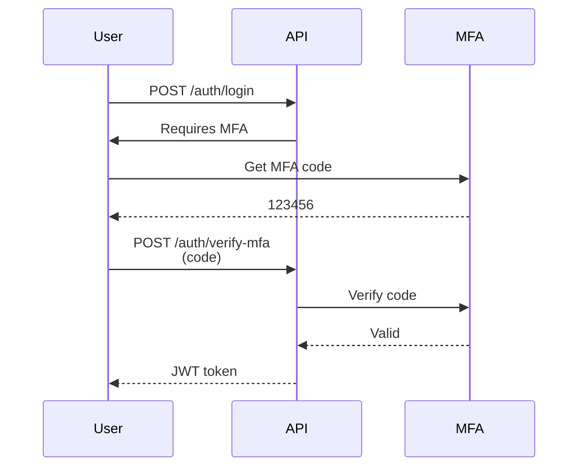

# JWT Authentication Flow Architecture

## Overview

PasteTrader implements JWT (JSON Web Token) based authentication for securing API endpoints. The authentication system provides secure user authentication, token validation, and protected resource access.

**Tags:** [SPEC-002] [ARCHITECTURE] [AUTH]

---

## Authentication Architecture



---

## Core Components

### 1. JWT Service

**Location:** `backend/app/core/jwt.py`

**Responsibilities:**
- Token generation (create_access_token)
- Token validation (verify_token)
- Token decoding (decode_access_token)

**Key Functions:**

```python
def create_access_token(subject: str, expires_delta: timedelta) -> str:
    """Generate JWT access token"""

def verify_token(token: str) -> str | None:
    """Verify token and return user ID"""

def decode_access_token(token: str) -> dict | None:
    """Decode token payload"""
```

---

### 2. Security Module

**Location:** `backend/app/core/security.py`

**Responsibilities:**
- Password hashing (bcrypt)
- Password verification
- Data encryption/decryption

**Key Functions:**

```python
def verify_password(plain_password: str, hashed_password: str) -> bool:
    """Verify password against hash"""

def get_password_hash(password: str) -> str:
    """Generate password hash"""

def encrypt_data(data: str) -> str:
    """Encrypt sensitive data"""

def decrypt_data(encrypted_data: str) -> str:
    """Decrypt sensitive data"""
```

---

### 3. Authentication Dependencies

**Location:** `backend/app/api/deps.py`

**Responsibilities:**
- Token extraction from headers
- Token validation
- User context loading
- Authorization checks

**Key Dependencies:**

```python
async def get_current_user(token: str = Depends(oauth2_scheme)) -> User:
    """Get authenticated user from token"""

async def get_current_active_user(
    current_user: User = Depends(get_current_user)
) -> User:
    """Get active authenticated user"""
```

---

## Token Lifecycle



### Token States

| State | Description | Duration |
|-------|-------------|----------|
| Generated | Token created but not yet used | Instant |
| Active | Token valid and usable | Up to 7 days |
| Validating | Token being validated | Instant |
| Expired | Token past expiration | Permanent |
| Revoked | Token invalidated (optional) | Permanent |

---

## Token Structure

### JWT Header

```json
{
  "alg": "HS256",
  "typ": "JWT"
}
```

### JWT Payload

```json
{
  "sub": "550e8400-e29b-41d4-a716-44665540000",
  "exp": 1737548000,
  "iat": 1736943200
}
```

### JWT Signature

```
HMACSHA256(
  base64UrlEncode(header) + "." + base64UrlEncode(payload),
  secret_key
)
```

### Token Claims

| Claim | Description | Example |
|-------|-------------|---------|
| `sub` | Subject (User ID) | UUID string |
| `exp` | Expiration timestamp | Unix timestamp |
| `iat` | Issued at timestamp | Unix timestamp |

---

## Password Security

### Hashing Algorithm

**Algorithm:** bcrypt (Blowfish-based)

**Cost Factor:** 12 (default, adjustable)

**Implementation:** `bcrypt` library

**Process:**
1. Generate random salt
2. Hash password with salt
3. Store hash in database

### Password Verification Flow



### Security Best Practices

- **Never store plain-text passwords**
- **Use bcrypt with cost factor >= 12**
- **Unique salt per password**
- **Constant-time comparison**
- **Rate limiting on login attempts**

---

## Protected Endpoints

### Endpoint Protection

Protected endpoints use FastAPI's dependency injection:

```python
@router.get("/")
async def get_tools(
    current_user: User = Depends(get_current_user)
):
    """Protected endpoint"""
    pass
```

### Authorization Flow



---

## Token Configuration

### Environment Variables

**Location:** `backend/.env`

```env
SECRET_KEY=your-secret-key-min-32-chars
JWT_ALGORITHM=HS256
ACCESS_TOKEN_EXPIRE_MINUTES=10080
```

### Configuration Module

**Location:** `backend/app/core/config.py`

```python
class Settings(BaseSettings):
    SECRET_KEY: str
    JWT_ALGORITHM: str = "HS256"
    ACCESS_TOKEN_EXPIRE_MINUTES: int = 10080

    class Config:
        env_file = ".env"
```

---

## Error Handling

### Authentication Errors

| Error | HTTP Status | Description |
|-------|-------------|-------------|
| MissingToken | 401 | Authorization header not provided |
| InvalidToken | 401 | Token signature verification failed |
| ExpiredToken | 401 | Token past expiration time |
| MalformedToken | 401 | Token format incorrect |
| UserNotFound | 401 | User not found in database |
| InactiveUser | 401 | User account deactivated |

### Error Response Format

```json
{
  "detail": "Could not validate credentials",
  "code": "INVALID_TOKEN"
}
```

---

## Security Considerations

### Secret Key Management

**Recommendations:**
- Use strong random key (>= 32 characters)
- Store in environment variable (not in code)
- Rotate periodically (every 90 days)
- Never commit to version control
- Use different keys for dev/staging/prod

**Generation:**
```bash
# Generate secure random key
python -c "import secrets; print(secrets.token_urlsafe(32))"
```

### Token Storage Best Practices

**Client-Side:**
- Use memory (React state, Vue store)
- Use httpOnly cookies for web
- Implement refresh token mechanism
- Avoid localStorage (XSS risk)

**Server-Side:**
- Implement token blacklist (optional)
- Log suspicious token usage
- Monitor authentication failures
- Implement rate limiting

### Transmission Security

**Requirements:**
- Always use HTTPS in production
- Never include tokens in URL
- Use Authorization header format
- Implement CORS properly
- Set secure cookie flags

---

## Token Refresh Strategy

### Current Implementation

- **Token Lifetime:** 7 days
- **Refresh:** Not implemented (re-login required)
- **Storage:** Client-side storage

### Recommended Enhancement



**Benefits:**
- Better user experience
- Reduced login frequency
- Revocable access

---

## Multi-Factor Authentication (Future)

### Proposed MFA Flow



---

## Session Management

### Current State

- **Stateless:** JWT tokens are stateless
- **No Server Storage:** Tokens not stored server-side
- **Client Storage:** Tokens stored on client

### Future Enhancement: Token Blacklist

```python
class TokenBlacklist(Base):
    """Blacklisted tokens for logout"""
    id: UUID
    token_jti: str  # JWT ID
    blacklisted_at: datetime
    expires_at: datetime
```

**Usage:**
- Add token to blacklist on logout
- Check blacklist during validation
- Clean up expired tokens periodically

---

## Monitoring and Logging

### Authentication Events

**Events to Log:**
- Successful login
- Failed login attempt
- Token expiration
- Token validation failure
- Password change
- Account lockout

**Log Format:**
```json
{
  "event": "login_success",
  "user_id": "uuid",
  "ip_address": "192.168.1.1",
  "user_agent": "Mozilla/5.0...",
  "timestamp": "2026-01-15T10:00:00Z"
}
```

---

## Related Documentation

- [Authentication Guide](../api/authentication.md) - API authentication usage
- [Tool-Agent Registry](./tool-agent-registry.md) - Protected resource management
- [User Schema](../database/schemas/user-schema.md) - User data model
- [JWT Specification](https://tools.ietf.org/html/rfc7519) - JWT RFC
