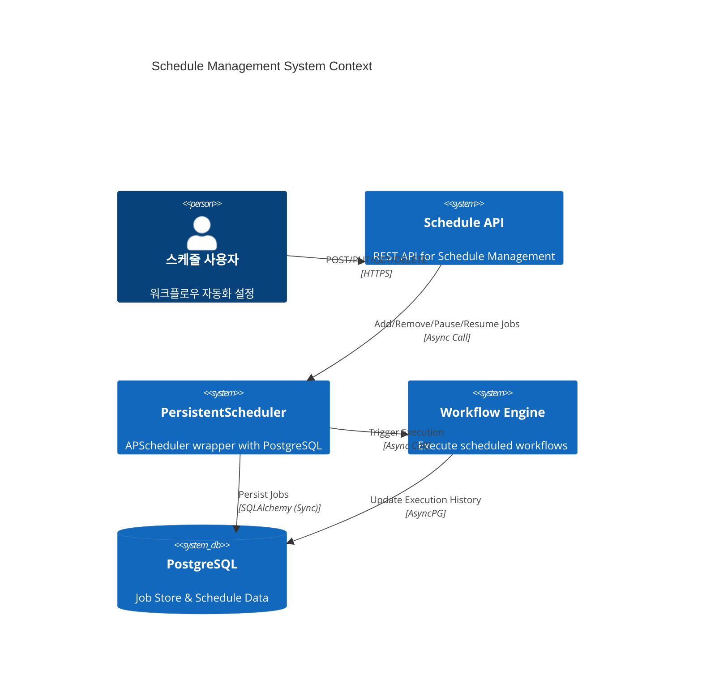
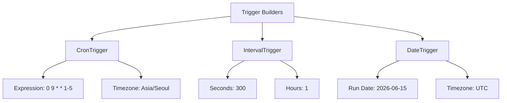
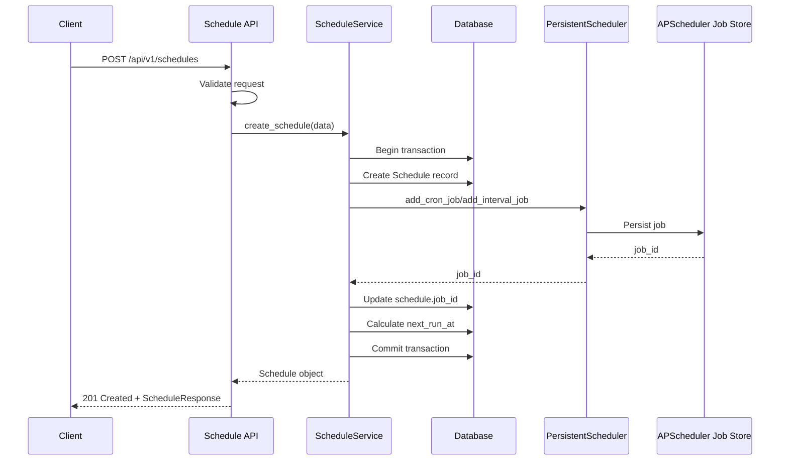
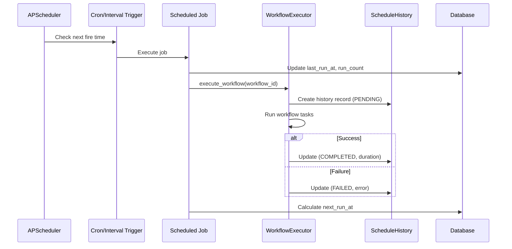
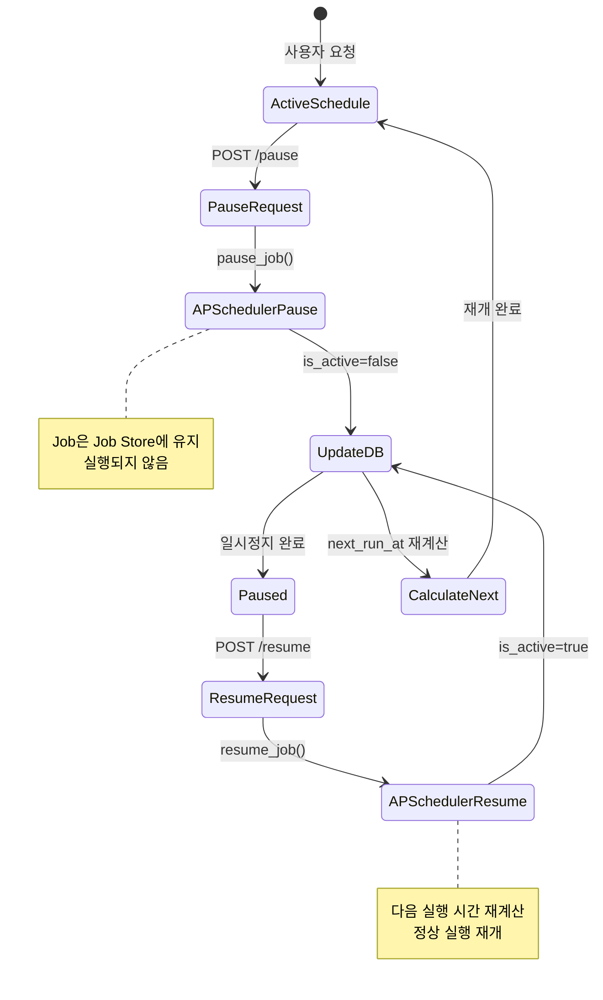
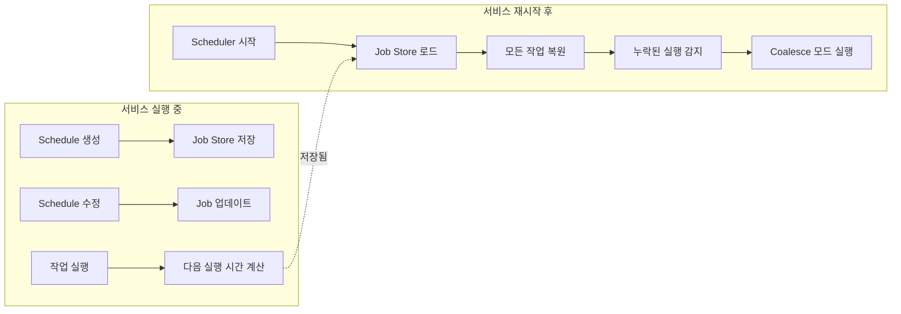
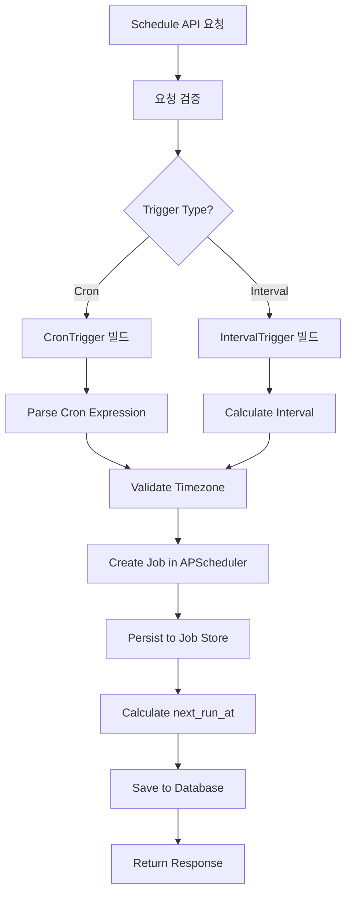
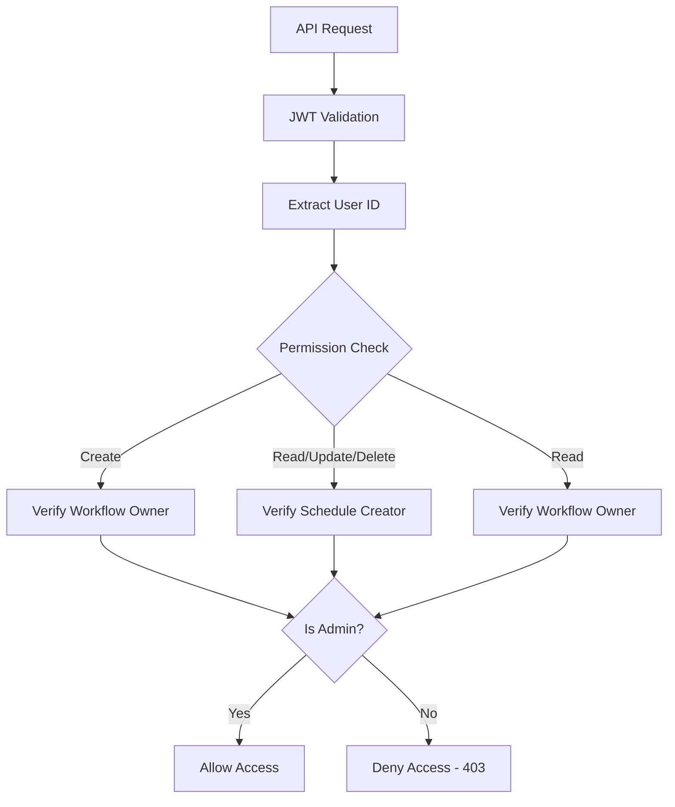
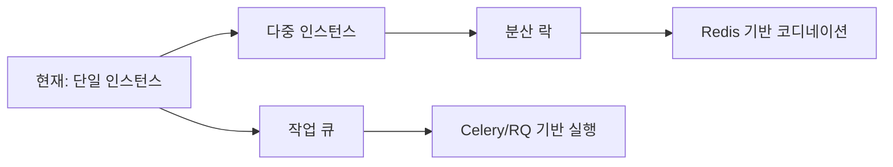

# Schedule Management Architecture

## Overview

Schedule Management Service는 APScheduler 기반의 지속성 있는 워크플로우 스케줄링 시스템을 제공합니다. PostgreSQL Job Store를 통해 서비스 재시작 후에도 스케줄이 유지되며, Cron 표현식과 간격 기반 스케줄링을 모두 지원합니다.

**태그:** [SPEC-013] [ARCHITECTURE] [SCHEDULE]

---

## 시스템 아키텍처

### 컴포넌트 개요



---

## 컨테이너 다이어그램

### 내부 컴포넌트 구조

```mermaid
C4Container
    title Schedule Management Container

    Container_Boundary(api, "FastAPI Application") {
        Container(schedules_api, "Schedule API", "Python/FastAPI", "REST 엔드포인트 (7개)")
        Container(scheduler_service, "ScheduleService", "Python", "비즈니스 로직")
        Container(scheduler_core, "PersistentScheduler", "Python/APScheduler", "스케줄링 엔진")
        Container(triggers, "Trigger Builders", "Python", "Cron/Interval 트리거 생성")
    }

    ContainerDb(postgres, "PostgreSQL", "PostgreSQL 16", {
        ContainerDb(schedules_table, "schedules", "Schedule Configuration")
        ContainerDb(history_table, "schedule_history", "Execution History")
        ContainerDb(jobstore_table, "apscheduler_jobs", "Job Store")
    })

    System_Ext(workflow_executor, "Workflow Executor", "워크플로우 실행 엔진")

    Rel(schedules_api, scheduler_service, "CRUD Operations", "Function Call")
    Rel(scheduler_service, scheduler_core, "Job Management", "Async Method")
    Rel(scheduler_service, triggers, "Build Triggers", "Function Call")
    Rel(scheduler_core, postgres, "Job Persistence", "SQLAlchemy (Sync)")
    Rel(scheduler_core, workflow_executor, "Execute Workflow", "Async Trigger")
```

---

## 컴포넌트 상세

### 1. PersistentScheduler (APScheduler 래퍼)

**위치:** `backend/app/services/schedule/scheduler.py`

**책임:**
- APScheduler AsyncIOScheduler 래핑
- PostgreSQL Job Store 관리
- 작업 수명 주기 관리 (start/shutdown)
- Cron 및 Interval 작업 추가/제거
- 작업 일시정지/재개

**주요 메서드:**

```python
class PersistentScheduler:
    async def start() -> None
    async def shutdown(wait: bool) -> None
    async def add_cron_job(job_func, trigger_args, job_id) -> str
    async def add_interval_job(job_func, seconds, job_id) -> str
    async def remove_job(job_id) -> bool
    async def pause_job(job_id) -> bool
    async def resume_job(job_id) -> bool
    async def get_job(job_id)
    async def get_next_run_time(job_id) -> datetime | None
```

---

### 2. Trigger Builders

**위치:** `backend/app/services/schedule/triggers.py`

**책임:**
- CronTrigger 구성
- IntervalTrigger 구성
- 시간대 처리
- 트리거 검증

**트리거 유형:**



---

### 3. Schedule API

**위치:** `backend/app/api/v1/schedules.py`

**엔드포인트:**

| 메서드 | 경로 | 설명 |
|--------|------|------|
| POST | `/api/v1/schedules` | 스케줄 생성 |
| GET | `/api/v1/schedules` | 스케줄 목록 조회 |
| GET | `/api/v1/schedules/{id}` | 스케줄 상세 조회 |
| PUT | `/api/v1/schedules/{id}` | 스케줄 수정 |
| DELETE | `/api/v1/schedules/{id}` | 스케줄 삭제 |
| POST | `/api/v1/schedules/{id}/pause` | 스케줄 일시정지 |
| POST | `/api/v1/schedules/{id}/resume` | 스케줄 재개 |

---

## 데이터 흐름

### 스케줄 생성 흐름



---

### 스케줄 실행 흐름



---

### 스케줄 일시정지/재개 흐름



---

## Job Store 지속성

### PostgreSQL Job Store 설정

```python
# APScheduler는 동기 드라이버만 지원
sync_url = async_db_url.replace("+asyncpg", "").replace("postgresql://", "postgresql+psycopg2://")

jobstores = {
    'default': SQLAlchemyJobStore(
        url=sync_url,
        tablename='apscheduler_jobs'
    )
}

scheduler = AsyncIOScheduler(
    jobstores=jobstores,
    job_defaults={
        'coalesce': True,      # 누락된 실행 병합
        'max_instances': 1,    # 최대 동시 실행 수
        'misfire_grace_time': 60  # 오실행 허용 시간(초)
    }
)
```

### Job Store 스키마

```sql
CREATE TABLE apscheduler_jobs (
    id VARCHAR(191) PRIMARY KEY,
    next_run_time TIMESTAMP WITH TIME ZONE NOT NULL,
    job_state BYTEA NOT NULL
);

CREATE INDEX ix_apscheduler_jobs_next_run_time
    ON apscheduler_jobs(next_run_time);
```

### 지속성 보장



---

## 스케줄러 수명 주기

### 애플리케이션 시작

```python
@app.on_event("startup")
async def startup_event():
    await persistent_scheduler.start()
    logger.info(f"Scheduler started with {len(scheduler.get_jobs())} jobs")
```

### 애플리케이션 종료

```python
@app.on_event("shutdown")
async def shutdown_event():
    await persistent_scheduler.shutdown(wait=True)
    logger.info("Scheduler shutdown complete")
```

---

## 스케줄러 작업 실행

### 작업 등록 프로세스



---

## 보안 아키텍처

### 인증 및 권한



### 권한 규칙

| 작업 | 필요 권한 | 검증 로직 |
|------|-----------|-----------|
| 생성 | 워크플로우 소유자 | `workflow.owner_id == user.id` |
| 조회 | 스케줄 생성자 또는 워크플로우 소유자 | `schedule.user_id == user.id` OR `workflow.owner_id == user.id` |
| 수정 | 스케줄 생성자 또는 워크플로우 소유자 | `schedule.user_id == user.id` OR `workflow.owner_id == user.id` |
| 삭제 (소프트) | 스케줄 생성자 또는 워크플로우 소유자 | `schedule.user_id == user.id` OR `workflow.owner_id == user.id` |
| 삭제 (하드) | 관리자만 | `user.email.endswith("@admin.local")` |

---

## 성능 최적화

### 인덱스 전략

```sql
-- 활성 스케줄 조회 (자주 사용)
CREATE INDEX idx_schedule_active_next_run
    ON schedules(is_active, next_run_at)
    WHERE deleted_at IS NULL;

-- 워크플로우별 스케줄
CREATE INDEX idx_schedule_workflow_active
    ON schedules(workflow_id, is_active)
    WHERE deleted_at IS NULL;

-- 최근 실행 이력 (30일 보관)
CREATE INDEX idx_schedule_history_recent
    ON schedule_history(schedule_id, triggered_at DESC)
    WHERE triggered_at >= NOW() - INTERVAL '30 days';
```

### 쿼리 최적화

- **페이지네이션**: OFFSET/LIMIT 대신 커서 기반 페이지네이션 고려
- **필터링**: 인덱스 활용을 위한 쿼리 최적화
- **조인 최소화**: 필요한 관계만 로드 (selectinload)

---

## 오류 처리

### 일반 오류 시나리오

```mermaid
graph TD
    Execute[작업 실행] --> Try{Try Execute}

    Try -->|Success| Complete[완료 상태 기록]
    Try -->|Failure| Error{Error Type?}

    Error -->|Network| Retry[재시도 (최대 3회)]
    Error -->|Validation| LogValidationError[검증 오류 로그]
    Error -->|Execution| LogExecutionError[실행 오류 로그]

    Retry --> Try
    LogValidationError --> FailedRecord[실패 기록]
    LogExecutionError --> FailedRecord

    Complete --> Stats[통계 업데이트]
    FailedRecord --> Stats
```

---

## 모니터링 및 메트릭

### 수집 메트릭

| 메트릭 | 설명 | 목적 |
|--------|------|------|
| `schedule_count` | 활성 스케줄 수 | 시스템 로드 모니터링 |
| `execution_total` | 총 실행 횟수 | 사용량 추적 |
| `execution_success_rate` | 성공률 | 신뢰성 모니터링 |
| `execution_duration_p99` | 99번째 백분위 지속시간 | 성능 모니터링 |
| `missed_executions` | 누락된 실행 수 | 서비스 상태 확인 |

---

## 확장성 고려사항

### 현재 제약사항

- **단일 인스턴스**: 하나의 스케줄러 인스턴스만 실행 가능
- **최대 스케줄 수**: 1000개 활성 스케줄
- **이력 보관**: 기본 30일 (구성 가능)

### 향후 확장



---

## 관련 문서

- [Schedule API Reference](../api/schedules.md) - API 엔드포인트 문서
- [Schedule Schema](../database/schemas/schedule-schema.md) - 데이터베이스 스키마
- [APScheduler 공식 문서](https://apscheduler.readthedocs.io/) - APScheduler 라이브러리
- [Workflow Execution Architecture](./workflow-execution.md) - 워크플로우 실행 아키텍처
