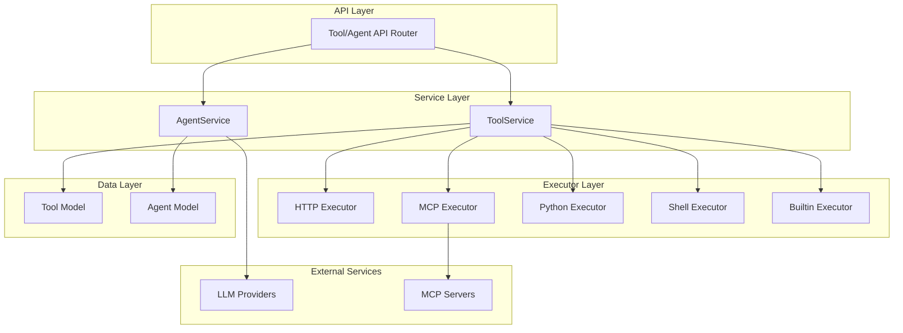
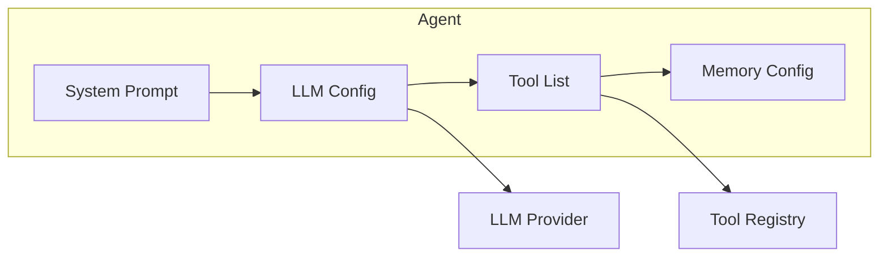
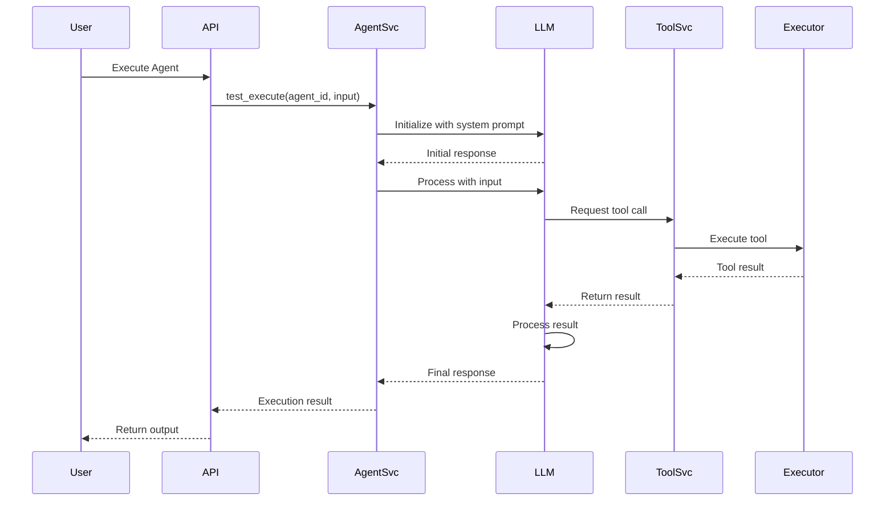

# Tool-Agent Registry Architecture

## Overview

The Tool-Agent Registry is the central component responsible for managing executable tools and AI-powered agents in the PasteTrader platform. It provides a unified interface for registering, discovering, and executing tools and agents across different providers and execution environments.

**Tags:** [SPEC-004] [ARCHITECTURE] [REGISTRY]

---

## System Architecture



---

## Core Components

### 1. Tool Registry

The Tool Registry manages all executable tools in the system.

**Location:** `backend/app/services/tool_service.py`

**Responsibilities:**
- Tool CRUD operations
- Tool configuration validation
- Tool execution orchestration
- Tool-association management

**Key Methods:**

| Method | Description |
|--------|-------------|
| `create()` | Create a new tool |
| `get()` | Retrieve tool by ID |
| `list()` | List tools with filters |
| `update()` | Update tool configuration |
| `delete()` | Soft delete tool |
| `test_execute()` | Test tool execution |
| `validate_config()` | Validate tool configuration |

---

### 2. Agent Manager

The Agent Manager manages AI-powered agents and their tool associations.

**Location:** `backend/app/services/agent_service.py`

**Responsibilities:**
- Agent CRUD operations
- Agent-tool association management
- Agent execution orchestration
- LLM provider routing

**Key Methods:**

| Method | Description |
|--------|-------------|
| `create()` | Create a new agent |
| `get()` | Retrieve agent by ID |
| `list()` | List agents with filters |
| `update()` | Update agent configuration |
| `delete()` | Soft delete agent |
| `add_tool()` | Associate tool with agent |
| `remove_tool()` | Remove tool association |
| `test_execute()` | Test agent execution |

---

## Tool Types and Executors

PasteTrader supports five types of tools, each with a dedicated executor:

### HTTP Executor

**Purpose:** Execute HTTP/HTTPS API calls

**Location:** `backend/app/services/executors/http_executor.py`

**Config Fields:**
```json
{
  "url": "https://api.example.com/endpoint",
  "method": "GET",
  "headers": {"Content-Type": "application/json"},
  "timeout": 30
}
```

**Use Cases:**
- External API integration
- Webhook calls
- REST service interactions

---

### MCP Executor

**Purpose:** Execute MCP (Model Context Protocol) server calls

**Config Fields:**
```json
{
  "server_url": "http://localhost:3000/mcp",
  "method": "call_tool",
  "timeout": 30
}
```

**Use Cases:**
- Context-aware tool execution
- Multi-server tool coordination
- Model-context protocol operations

---

### Python Executor

**Purpose:** Execute Python code dynamically

**Config Fields:**
```json
{
  "code": "def calculate_rsi(prices, period=14):\n    ...",
  "timeout": 10,
  "libraries": ["pandas", "numpy"]
}
```

**Use Cases:**
- Custom calculations
- Data transformations
- Algorithm implementations

---

### Shell Executor

**Purpose:** Execute shell commands

**Config Fields:**
```json
{
  "command": "python process_data.py --input data.csv",
  "working_dir": "/tmp",
  "timeout": 60,
  "env": {"API_KEY": "secret"}
}
```

**Use Cases:**
- Script execution
- System operations
- Batch processing

---

### Builtin Executor

**Purpose:** Execute built-in system operations

**Config Fields:**
```json
{
  "operation": "calculate_rsi",
  "parameters": {"period": 14, "overbought": 70}
}
```

**Use Cases:**
- Predefined calculations
- System utilities
- Common operations

---

## Agent Architecture

### Agent Composition



### Agent Execution Flow



---

## Tool-Agent Association

### Association Model

Tools and agents have a many-to-many relationship:

- One tool can be used by multiple agents
- One agent can use multiple tools
- Associations are stored in the agent's `tools` field (JSONB array)

**Data Structure:**
```json
{
  "agent_id": "uuid",
  "tools": [
    "tool-uuid-1",
    "tool-uuid-2",
    "tool-uuid-3"
  ]
}
```

### Association Management

**Add Tool:**
```
POST /api/v1/agents/{agent_id}/tools
Body: {"tool_id": "tool-uuid"}
```

**Remove Tool:**
```
DELETE /api/v1/agents/{agent_id}/tools/{tool_id}
```

**Validation:**
- Tool must exist
- Tool cannot be duplicated
- Agent must be active

---

## Configuration Validation

### Tool Config Validation

Each tool type has specific required fields:

| Tool Type | Required Fields | Optional Fields |
|-----------|----------------|-----------------|
| http | url, method | headers, timeout |
| mcp | server_url, method | timeout |
| python | code | timeout, libraries |
| shell | command | working_dir, timeout, env |
| builtin | operation | parameters, timeout |

**Validation Logic:**
```python
def validate_tool_config(tool_type: str, config: dict) -> None:
    required_fields = {
        "http": ["url", "method"],
        "mcp": ["server_url"],
        "python": ["code"],
        "shell": ["command"],
        "builtin": ["operation"]
    }

    for field in required_fields.get(tool_type, []):
        if field not in config:
            raise ValueError(f"Missing required field: {field}")
```

### Agent Config Validation

Agent configuration includes:

- **Model Config**: temperature, max_tokens, top_p
- **Memory Config**: max_turns, context_window
- **System Prompt**: Must be valid string
- **Tool List**: Must be valid UUIDs

---

## Execution Context

### Tool Execution Context

When a tool is executed, it receives:

```python
{
    "tool_id": "uuid",
    "tool_type": "http|mcp|python|shell|builtin",
    "config": {...},
    "input_data": {...},
    "auth_config": {...},  # Decrypted
    "owner_id": "uuid"
}
```

### Agent Execution Context

When an agent is executed, it receives:

```python
{
    "agent_id": "uuid",
    "system_prompt": "...",
    "model_provider": "anthropic|openai|glm",
    "model_name": "...",
    "model_config": {...},
    "tools": [...],
    "memory_config": {...},
    "input_data": {...},
    "owner_id": "uuid"
}
```

---

## Security Considerations

### Authentication Configuration

**Storage:** Tool `auth_config` is encrypted at rest using AES-256-GCM

**Encryption Location:** `backend/app/core/security.py`

**Fields Encrypted:**
- API keys
- Bearer tokens
- Passwords
- Certificates

**Decryption:** Only occurs during tool execution in memory

### Execution Sandboxing

**Current Implementation:**
- Python executor: Uses restricted globals
- Shell executor: Timeout enforced
- HTTP executor: URL whitelist validation

**Future Enhancements:**
- Container-based isolation
- Resource limits (CPU, memory)
- Network restrictions

### Access Control

**Ownership Model:**
- Each tool/agent has an `owner_id`
- Only owner can modify their resources
- Public resources can be read by anyone

**Implementation:**
```python
async def get_tool(tool_id: UUID, owner_id: UUID) -> Tool:
    tool = await db.get(Tool, tool_id)
    if tool.owner_id != owner_id and not tool.is_public:
        raise PermissionError("Access denied")
    return tool
```

---

## Performance Optimization

### Caching Strategy

**Tool Config Caching:**
- LRU cache for frequently accessed tools
- TTL: 5 minutes
- Invalidation on tool update

**Executor Pooling:**
- Reuse HTTP sessions
- Maintain Python interpreter state
- Shell process pooling

### Database Optimization

**Indexes:**
- `owner_id`: User resource queries
- `tool_type`: Type filtering
- `is_active`: Active resource filtering
- `is_public`: Public resource filtering

**Query Examples:**
```sql
-- Fast user resource lookup
CREATE INDEX idx_tool_owner ON tools(owner_id) WHERE is_deleted IS FALSE;

-- Type-based filtering
CREATE INDEX idx_tool_type ON tools(tool_type) WHERE is_deleted IS FALSE;
```

---

## Error Handling

### Tool Execution Errors

| Error Type | Description | HTTP Status |
|------------|-------------|-------------|
| ToolNotFoundError | Tool not found | 404 |
| InvalidToolConfigError | Configuration validation failed | 400 |
| ToolExecutionError | Execution failure | 400 |
| ResourceInUseError | Tool used by agents/workflows | 409 |

### Agent Execution Errors

| Error Type | Description | HTTP Status |
|------------|-------------|-------------|
| AgentNotFoundError | Agent not found | 404 |
| AgentServiceError | Service error | 400 |
| AgentExecutionError | Execution failure | 400 |
| ToolAlreadyAssociatedError | Duplicate tool association | 409 |

---

## Testing Strategy

### Unit Tests

- Tool service methods
- Agent service methods
- Config validation
- Error handling

### Integration Tests

- Tool execution with real APIs
- Agent execution with LLM providers
- Tool-agent associations
- Database operations

### Test Coverage

**Current:** 85.60% overall

**Target:** >90% for service layer

---

## Related Documentation

- [Tool API Reference](../api/tools.md) - Tool endpoint documentation
- [Agent API Reference](../api/agents.md) - Agent endpoint documentation
- [Tool Schema](../database/schemas/tool-schema.md) - Tool data model
- [Agent Schema](../database/schemas/agent-schema.md) - Agent data model
- [JWT Auth Flow](./jwt-auth-flow.md) - Authentication architecture
