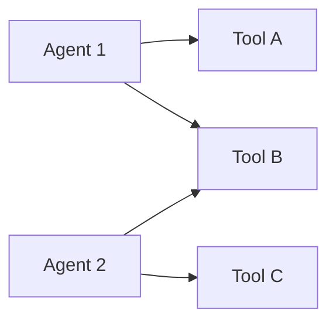
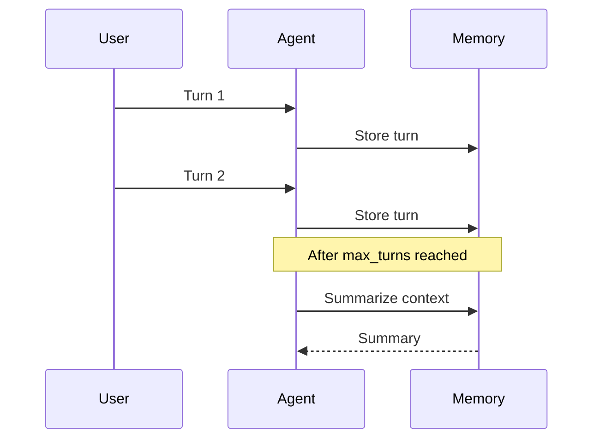
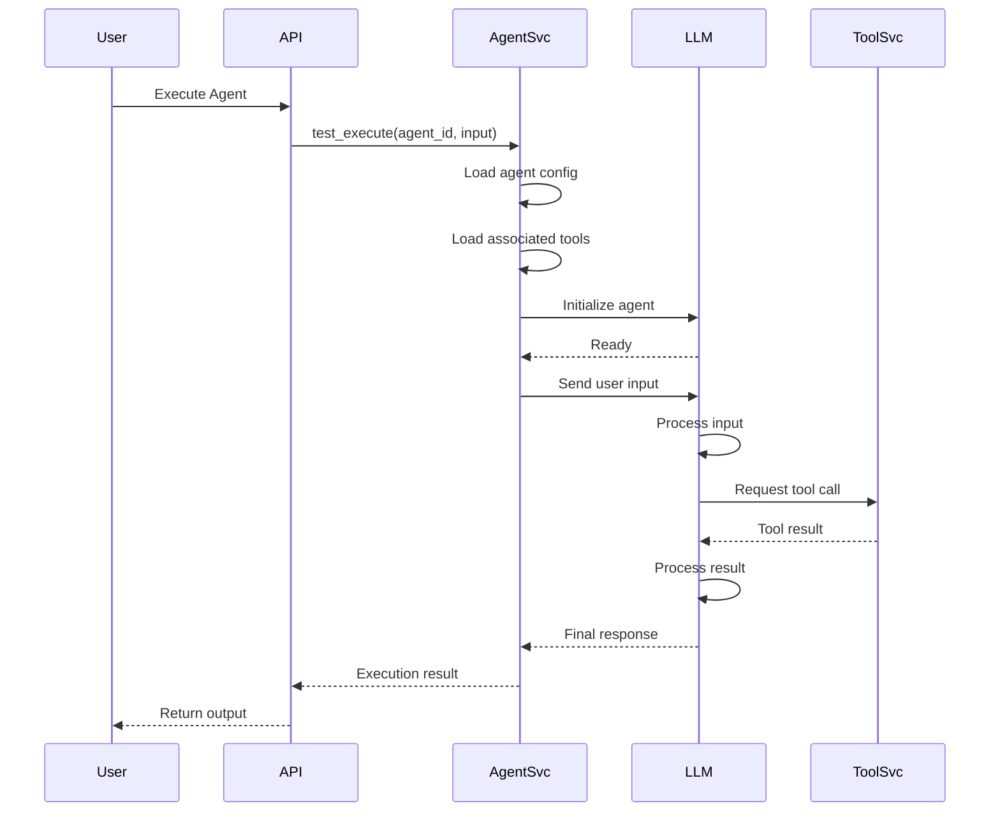

# Agent Schema Documentation

## Overview

The Agent schema defines the data model for AI-powered agents in the PasteTrader platform. Agents are LLM-based reasoning entities that can use tools to perform complex tasks autonomously.

**Tags:** [SPEC-009] [SCHEMA] [AGENT]

**Table Name:** `agents`

---

## Schema Definition

### SQLAlchemy Model

**Location:** `backend/app/models/agent.py`

```python
class Agent(UUIDMixin, TimestampMixin, SoftDeleteMixin, Base):
    """Agent model for LLM-powered agent configuration."""

    __tablename__ = "agents"

    owner_id: Mapped[UUID] = mapped_column(
        ForeignKey("users.id"),
        nullable=False,
        index=True,
    )
    name: Mapped[str] = mapped_column(
        String(255),
        nullable=False,
        unique=True,
        index=True,
    )
    description: Mapped[str | None] = mapped_column(
        String(2000),
        nullable=True,
    )
    system_prompt: Mapped[str | None] = mapped_column(
        Text,
        nullable=True,
    )
    model_provider: Mapped[str] = mapped_column(
        String(50),
        nullable=False,
        index=True,
    )
    model_name: Mapped[str] = mapped_column(
        String(100),
        nullable=False,
    )
    config: Mapped[dict[str, Any]] = mapped_column(
        JSONB,
        nullable=False,
        default=dict,
    )
    tools: Mapped[list[str]] = mapped_column(
        JSONB,
        nullable=False,
        default=list,
    )
    memory_config: Mapped[dict[str, Any] | None] = mapped_column(
        JSONB,
        nullable=True,
    )
    is_active: Mapped[bool] = mapped_column(
        Boolean,
        default=True,
        nullable=False,
        index=True,
    )
    is_public: Mapped[bool] = mapped_column(
        Boolean,
        default=False,
        nullable=False,
        index=True,
    )
```

---

## Field Descriptions

### Base Fields (Inherited)

| Field | Type | Description |
|-------|------|-------------|
| `id` | UUID | Primary key (inherited from UUIDMixin) |
| `created_at` | datetime | Creation timestamp (inherited from TimestampMixin) |
| `updated_at` | datetime | Last update timestamp (inherited from TimestampMixin) |
| `deleted_at` | datetime | Soft deletion timestamp (inherited from SoftDeleteMixin) |
| `is_deleted` | bool | Deletion status (inherited from SoftDeleteMixin) |

### Agent-Specific Fields

| Field | Type | Nullable | Indexed | Description |
|-------|------|----------|---------|-------------|
| `owner_id` | UUID | No | Yes | Foreign key to users table (agent owner) |
| `name` | string(255) | No | Yes | Unique agent name |
| `description` | string(2000) | Yes | No | Optional agent description |
| `system_prompt` | text | Yes | No | System prompt for LLM |
| `model_provider` | string(50) | No | Yes | LLM provider (anthropic, openai, glm) |
| `model_name` | string(100) | No | No | Specific model identifier |
| `config` | JSONB | No | No | Model configuration (temperature, etc.) |
| `tools` | JSONB (array) | No | No | List of tool UUIDs |
| `memory_config` | JSONB | Yes | No | Memory/context configuration |
| `is_active` | boolean | No | Yes | Active status flag |
| `is_public` | boolean | No | Yes | Public accessibility flag |

---

## LLM Providers

### Supported Providers

| Provider | Description | Models |
|----------|-------------|--------|
| `anthropic` | Anthropic Claude | claude-3-5-sonnet-20241022, claude-3-opus-20240229 |
| `openai` | OpenAI GPT | gpt-4-turbo-preview, gpt-4-vision-preview |
| `glm` | GLM (Zhipu AI) | glm-4-plus, glm-4-air |

### Model Configuration

```json
{
  "temperature": 0.7,
  "max_tokens": 4096,
  "top_p": 0.9,
  "top_k": 40,
  "stop_sequences": ["\\n\\nHuman:"]
}
```

### Model Config Fields

| Field | Type | Default | Range | Description |
|-------|------|---------|-------|-------------|
| `temperature` | float | 0.7 | 0.0-1.0 | Sampling temperature |
| `max_tokens` | integer | 4096 | 1-128000 | Maximum tokens to generate |
| `top_p` | float | 0.9 | 0.0-1.0 | Nucleus sampling threshold |
| `top_k` | integer | 40 | 1-100 | Top-k sampling |
| `stop_sequences` | array | null | - | Sequences that stop generation |

---

## System Prompt

### Purpose

The system prompt defines the agent's behavior, personality, and constraints. It's the first message sent to the LLM.

### Best Practices

```markdown
You are a professional trading analyst with 20 years of experience in technical analysis.

Your responsibilities:
- Analyze stock data using technical indicators
- Provide buy/sell/hold recommendations
- Explain your reasoning clearly

Constraints:
- Always consider risk management
- Never provide financial advice without disclaimer
- Use provided tools for data analysis
```

### Prompt Structure

1. **Role Definition**: Who the agent is
2. **Responsibilities**: What the agent should do
3. **Constraints**: What the agent should not do
4. **Output Format**: Expected response format
5. **Tool Usage**: How to use available tools

---

## Tool Associations

### Tools Field

The `tools` field is a JSONB array containing tool UUIDs:

```json
[
  "550e8400-e29b-41d4-a716-446655440000",
  "550e8400-e29b-41d4-a716-446655440001",
  "550e8400-e29b-41d4-a716-446655440002"
]
```

### Tool-Agent Relationship



**Characteristics:**
- Many-to-many relationship
- Tools stored as UUID array in agent
- No foreign key constraint (flexible)
- Validated at application layer

---

## Memory Configuration

### Memory Config Structure

```json
{
  "max_turns": 10,
  "context_window": 200000,
  "memory_type": "conversation",
  "summary_threshold": 5
}
```

### Memory Config Fields

| Field | Type | Default | Description |
|-------|------|---------|-------------|
| `max_turns` | integer | 10 | Maximum conversation turns to remember |
| `context_window` | integer | 200000 | Token limit for context window |
| `memory_type` | string | conversation | Type: conversation, summary, vector |
| `summary_threshold` | integer | 5 | Turns before summarization |

### Memory Management



---

## Constraints and Indexes

### Database Constraints

```sql
-- Primary key (inherited from UUIDMixin)
PRIMARY KEY (id)

-- Unique constraint
UNIQUE (name) WHERE is_deleted IS FALSE

-- Foreign key constraint
FOREIGN KEY (owner_id) REFERENCES users(id)

-- Check constraints
CHECK (model_provider IN ('anthropic', 'openai', 'glm'))
CHECK (is_active IS NOT NULL)
CHECK (is_public IS NOT NULL)
CHECK (jsonb_typeof(tools) = 'array')
```

### Database Indexes

```sql
-- Owner index (user resource queries)
CREATE INDEX idx_agent_owner ON agents(owner_id)
  WHERE is_deleted IS FALSE;

-- Name index (lookup by name)
CREATE INDEX idx_agent_name ON agents(name)
  WHERE is_deleted IS FALSE;

-- Provider index (filtering by provider)
CREATE INDEX idx_agent_provider ON agents(model_provider)
  WHERE is_deleted IS FALSE;

-- Active status index
CREATE INDEX idx_agent_active ON agents(is_active)
  WHERE is_deleted IS FALSE;

-- Public status index
CREATE INDEX idx_agent_public ON agents(is_public)
  WHERE is_deleted IS FALSE;

-- Composite index for user's active agents
CREATE INDEX idx_agent_owner_active ON agents(owner_id, is_active)
  WHERE is_deleted IS FALSE;

-- Composite index for provider filtering
CREATE INDEX idx_agent_owner_provider ON agents(owner_id, model_provider)
  WHERE is_deleted IS FALSE;
```

---

## Pydantic Schemas

### API Request/Response Schemas

**Location:** `backend/app/schemas/agent.py`

#### AgentCreate

```python
class AgentCreate(BaseSchema):
    name: str
    description: str | None
    system_prompt: str | None
    model_provider: str
    model_name: str
    config: dict[str, Any]
    tools: list[str]
    memory_config: dict[str, Any] | None
    is_active: bool
    is_public: bool
```

#### AgentUpdate

```python
class AgentUpdate(BaseSchema):
    name: str | None
    description: str | None
    system_prompt: str | None
    model_provider: str | None
    model_name: str | None
    config: dict[str, Any] | None
    tools: list[str] | None
    memory_config: dict[str, Any] | None
    is_active: bool | None
    is_public: bool | None
```

#### AgentResponse

```python
class AgentResponse(AgentBase, BaseResponse):
    owner_id: UUID
    # All AgentCreate fields plus timestamps
```

---

## Relationships

### User Relationship

```python
class Agent(Base):
    owner_id: Mapped[UUID] = mapped_column(ForeignKey("users.id"))
    owner: Mapped["User"] = relationship(back_populates="agents")
```

### Tool Relationship (Many-to-Many)

Tools are associated through the `tools` JSONB array:

```python
class Agent(Base):
    tools: Mapped[list[str]] = mapped_column(JSONB)
    # Contains list of tool UUID strings
```

---

## Migration

### Create Table Migration

```Alembic
def upgrade():
    op.create_table(
        'agents',
        sa.Column('id', postgresql.UUID(), nullable=False),
        sa.Column('owner_id', postgresql.UUID(), nullable=False),
        sa.Column('name', sa.String(255), nullable=False),
        sa.Column('description', sa.String(2000), nullable=True),
        sa.Column('system_prompt', sa.Text(), nullable=True),
        sa.Column('model_provider', sa.String(50), nullable=False),
        sa.Column('model_name', sa.String(100), nullable=False),
        sa.Column('config', postgresql.JSONB(), nullable=False),
        sa.Column('tools', postgresql.JSONB(), nullable=False),
        sa.Column('memory_config', postgresql.JSONB(), nullable=True),
        sa.Column('is_active', sa.Boolean(), nullable=False, default=True),
        sa.Column('is_public', sa.Boolean(), nullable=False, default=False),
        sa.Column('created_at', sa.DateTime(timezone=True), nullable=False),
        sa.Column('updated_at', sa.DateTime(timezone=True), nullable=True),
        sa.Column('deleted_at', sa.DateTime(timezone=True), nullable=True),
        sa.ForeignKeyConstraint(['owner_id'], ['users.id']),
        sa.PrimaryKeyConstraint('id'),
        sa.UniqueConstraint('name', name='uq_agent_name')
    )
```

---

## Validation Rules

### Name Validation

- Must be unique (case-insensitive)
- Length: 1-255 characters
- Allowed characters: alphanumeric, underscore, hyphen
- Cannot start with a number

### Model Provider Validation

- Must be one of: `anthropic`, `openai`, `glm`
- Case-sensitive

### Tools Validation

- Must be array of valid UUID strings
- Each UUID must exist in tools table
- No duplicate UUIDs allowed

### Config Validation

Model config must contain valid fields:
- `temperature`: 0.0-1.0 (float)
- `max_tokens`: 1-128000 (integer)
- `top_p`: 0.0-1.0 (float)
- `top_k`: 1-100 (integer)

---

## Execution Flow

### Agent Execution Sequence



---

## Related Documentation

- [Agent API Reference](../../api/agents.md) - Agent endpoint documentation
- [Tool-Agent Registry](../../architecture/tool-agent-registry.md) - System architecture
- [Tool Schema](./tool-schema.md) - Tool data model
- [User Schema](./user-schema.md) - User/owner data model
