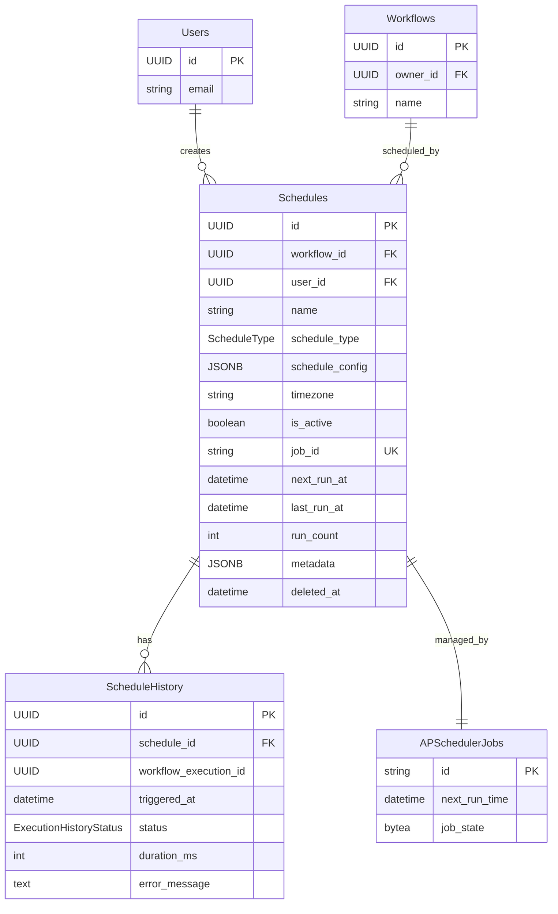
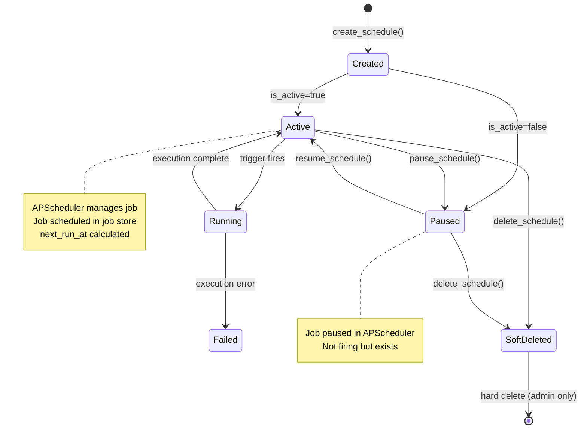
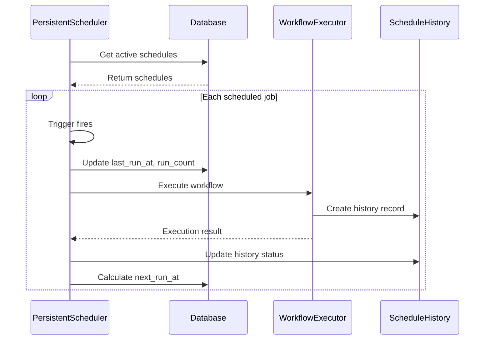

# Schedule Schema Documentation

## Overview

Schedule 스키마는 워크플로우 자동화를 위한 스케줄 구성과 실행 이력을 정의합니다. APScheduler 통합으로 지속성 있는 작업 스케줄링을 제공합니다.

**태그:** [SPEC-013] [SCHEMA] [SCHEDULE]

**테이블 이름:** `schedules`, `schedule_history`

---

## Schedule 모델

### SQLAlchemy 모델

**위치:** `backend/app/models/schedule.py`

```python
class Schedule(UUIDMixin, TimestampMixin, SoftDeleteMixin, Base):
    """Workflow schedule configuration model."""

    __tablename__ = "schedules"

    # Foreign keys
    workflow_id: Mapped[UUID] = mapped_column(
        ForeignKey("workflows.id"),
        nullable=False,
        index=True,
    )
    user_id: Mapped[UUID] = mapped_column(
        ForeignKey("users.id"),
        nullable=False,
        index=True,
    )

    # Basic information
    name: Mapped[str] = mapped_column(String(255), nullable=False)
    description: Mapped[str | None] = mapped_column(Text, nullable=True)

    # Schedule configuration
    schedule_type: Mapped[ScheduleType] = mapped_column(
        String(50),
        nullable=False,
        index=True,
    )
    schedule_config: Mapped[dict[str, Any]] = mapped_column(
        JSONB,
        nullable=False,
        default=dict,
    )
    timezone: Mapped[str] = mapped_column(
        String(50),
        nullable=False,
        default="UTC",
    )

    # Status
    is_active: Mapped[bool] = mapped_column(
        Boolean,
        default=True,
        nullable=False,
    )

    # APScheduler integration
    job_id: Mapped[str | None] = mapped_column(
        String(255),
        nullable=True,
        unique=True,
        index=True,
    )
    next_run_at: Mapped[datetime | None] = mapped_column(
        DateTime(timezone=True),
        nullable=True,
        index=True,
    )
    last_run_at: Mapped[datetime | None] = mapped_column(
        DateTime(timezone=True),
        nullable=True,
    )
    run_count: Mapped[int] = mapped_column(
        Integer,
        nullable=False,
        default=0,
    )

    # Metadata
    metadata_: Mapped[dict[str, Any]] = mapped_column(
        "metadata",
        JSONB,
        nullable=False,
        default=dict,
    )
```

---

## 필드 설명

### 기본 필드 (상속)

| 필드 | 타입 | 설명 |
|-------|------|-------------|
| `id` | UUID | 기본 키 (UUIDMixin에서 상속) |
| `created_at` | datetime | 생성 타임스탬프 (TimestampMixin에서 상속) |
| `updated_at` | datetime | 마지막 업데이트 타임스탬프 (TimestampMixin에서 상속) |
| `deleted_at` | datetime | 소프트 삭제 타임스탬프 (SoftDeleteMixin에서 상속) |
| `is_deleted` | bool | 삭제 상태 (SoftDeleteMixin에서 상속) |

### Schedule 필드

| 필드 | 타입 | Nullable | Indexed | 설명 |
|-------|------|----------|---------|-------------|
| `workflow_id` | UUID | 아니오 | 예 | 워크플로우 외래 키 (대상 워크플로우) |
| `user_id` | UUID | 아니오 | 예 | 사용자 외래 키 (스케줄 생성자) |
| `name` | string(255) | 아니오 | 아니오 | 스케줄 표시 이름 |
| `description` | text | 예 | 아니오 | 스케줄 목적 설명 |
| `schedule_type` | string(50) | 아니오 | 예 | 스케줄 유형 (cron, interval, date) |
| `schedule_config` | JSONB | 아니오 | 아니오 | 스케줄별 설정 |
| `timezone` | string(50) | 아니오 | 아니오 | 시간대 (기본값: UTC) |
| `is_active` | boolean | 아니오 | 아니오 | 활성 상태 |
| `job_id` | string(255) | 예 | 예 | APScheduler 작업 ID |
| `next_run_at` | datetime(tz) | 예 | 예 | 다음 실행 예정 시간 |
| `last_run_at` | datetime(tz) | 예 | 아니오 | 마지막 실행 시간 |
| `run_count` | integer | 아니오 | 아니오 | 총 실행 횟수 |
| `metadata` | JSONB | 아니오 | 아니오 | 추가 메타데이터 |

---

## 스케줄 유형

### ScheduleType Enum

| 유형 | 값 | 설명 | 예시 |
|------|------|------|------|
| `CRON` | "cron" | Cron 표현식 기반 | `0 9 * * 1-5` |
| `INTERVAL` | "interval" | 고정 간격 기반 | 300초마다 |
| `DATE` | "date" | 일회성 실행 | 특정 날짜시간 |

---

## Schedule Config 구조

### Cron Schedule

```json
{
  "cron_expression": "0 9 * * 1-5",
  "year": null,
  "month": null,
  "day": null,
  "week": null,
  "day_of_week": "mon-fri",
  "hour": 9,
  "minute": 0,
  "second": 0,
  "start_date": "2026-01-01T00:00:00Z",
  "end_date": "2026-12-31T23:59:59Z"
}
```

### Interval Schedule

```json
{
  "weeks": 0,
  "days": 0,
  "hours": 1,
  "minutes": 30,
  "seconds": 0,
  "start_date": "2026-01-01T00:00:00Z",
  "end_date": null
}
```

### Date Schedule

```json
{
  "run_date": "2026-06-15T10:30:00Z"
}
```

---

## ScheduleHistory 모델

### SQLAlchemy 모델

```python
class ScheduleHistory(UUIDMixin, TimestampMixin, Base):
    """Schedule execution history model."""

    __tablename__ = "schedule_history"

    schedule_id: Mapped[UUID] = mapped_column(
        ForeignKey("schedules.id"),
        nullable=False,
        index=True,
    )
    workflow_execution_id: Mapped[UUID] = mapped_column(
        nullable=False,
    )
    triggered_at: Mapped[datetime] = mapped_column(
        DateTime(timezone=True),
        nullable=False,
    )
    status: Mapped[ExecutionHistoryStatus] = mapped_column(
        String(50),
        nullable=False,
    )
    duration_ms: Mapped[int] = mapped_column(
        Integer,
        nullable=False,
    )
    error_message: Mapped[str | None] = mapped_column(
        Text,
        nullable=True,
    )
```

---

## 실행 상태

### ExecutionHistoryStatus Enum

| 상태 | 값 | 설명 |
|------|------|------|
| `PENDING` | "pending" | 실행 대기 중 |
| `TRIGGERED` | "triggered" | 트리거됨 |
| `COMPLETED` | "completed" | 성공적으로 완료 |
| `FAILED` | "failed" | 실행 실패 |
| `MISSED` | "missed" | 실행 누락 |

---

## 제약조건 및 인덱스

### 데이터베이스 제약조건

```sql
-- Primary key (inherited from UUIDMixin)
PRIMARY KEY (id)

-- Foreign key constraints
FOREIGN KEY (workflow_id) REFERENCES workflows(id) ON DELETE CASCADE
FOREIGN KEY (user_id) REFERENCES users(id) ON DELETE CASCADE
FOREIGN KEY (schedule_id) REFERENCES schedules(id) ON DELETE CASCADE

-- Unique constraints
UNIQUE (job_id) WHERE job_id IS NOT NULL

-- Check constraints
CHECK (schedule_type IN ('cron', 'interval', 'date'))
CHECK (is_active IS NOT NULL)
CHECK (run_count >= 0)
```

### 데이터베이스 인덱스

```sql
-- Workflow index (schedule by workflow queries)
CREATE INDEX idx_schedule_workflow ON schedules(workflow_id)
  WHERE deleted_at IS NULL;

-- User index (schedule by creator queries)
CREATE INDEX idx_schedule_user ON schedules(user_id)
  WHERE deleted_at IS NULL;

-- Schedule type index (filtering by type)
CREATE INDEX idx_schedule_type ON schedules(schedule_type)
  WHERE deleted_at IS NULL;

-- Active status index
CREATE INDEX idx_schedule_active ON schedules(is_active)
  WHERE deleted_at IS NULL;

-- Job ID index (APScheduler lookups)
CREATE INDEX idx_schedule_job_id ON schedules(job_id)
  WHERE job_id IS NOT NULL AND deleted_at IS NULL;

-- Next run time index (scheduler queries)
CREATE INDEX idx_schedule_next_run ON schedules(next_run_at)
  WHERE deleted_at IS NULL;

-- Schedule history index (history queries)
CREATE INDEX idx_schedule_history_schedule ON schedule_history(schedule_id)
  WHERE created_at >= NOW() - INTERVAL '30 days';

-- Composite index for active schedules by workflow
CREATE INDEX idx_schedule_workflow_active ON schedules(workflow_id, is_active)
  WHERE deleted_at IS NULL;
```

---

## 관계 다이어그램



---

## 스케줄 수명 주기



---

## 스케줄 실행 흐름



---

## Pydantic 스키마

### API 요청/응답 스키마

**위치:** `backend/app/schemas/schedule.py`

#### ScheduleCreate

```python
class ScheduleCreate(BaseSchema):
    workflow_id: UUID
    name: str
    description: str | None
    trigger_type: TriggerType
    cron_expression: str | None
    interval_weeks: PositiveInt | None
    interval_days: PositiveInt | None
    interval_hours: PositiveInt | None
    interval_minutes: PositiveInt | None
    interval_seconds: PositiveInt | None
    timezone: str
```

#### ScheduleResponse

```python
class ScheduleResponse(BaseResponse):
    workflow_id: UUID
    name: str
    description: str | None
    schedule_type: ScheduleType
    schedule_config: dict[str, Any]
    timezone: str
    is_active: bool
    next_run_at: datetime | None
    last_run_at: datetime | None
    run_count: int
```

#### ScheduleStatistics

```python
class ScheduleStatistics(BaseSchema):
    total_runs: int
    successful_runs: int
    failed_runs: int
    success_rate: float
    average_duration_ms: int | None
    last_run_at: datetime | None
    last_status: ExecutionHistoryStatus | None
```

---

## 메타데이터 구조

### Metadata 필드

```json
{
  "priority": "normal",
  "tags": ["daily", "market-open"],
  "notification": {
    "on_success": false,
    "on_failure": true,
    "channels": ["slack", "email"]
  },
  "max_instances": 1,
  "coalesce": true,
  "misfire_grace_time": 60
}
```

### Metadata 필드

| 필드 | 타입 | 기본값 | 설명 |
|-------|------|---------|-------------|
| `priority` | string | "normal" | 실행 우선순위 |
| `tags` | array | [] | 사용자 정의 태그 |
| `notification` | object | {} | 알림 설정 |
| `max_instances` | integer | 1 | 최대 동시 실행 수 |
| `coalesce` | boolean | true | 누락 실행 병합 |
| `misfire_grace_time` | integer | 60 | 오실행 허용 시간(초) |

---

## 검증 규칙

### 이름 검증

- 길이: 1-255 문자
- 필수 필드

### Cron 표현식 검증

- 5 또는 6 필드
- 필드 범위:
  - 분: 0-59
  - 시: 0-23
  - 일: 1-31
  - 월: 1-12
  - 요일: 0-7 (0과 7은 일요일)
  - 연도: 1970-2099 (선택)

### 간격 검증

- 최소 하나의 간격 필드 필요
- 모든 값은 양수
- `interval_weeks`, `interval_days`, `interval_hours`, `interval_minutes`, `interval_seconds`

### 시간대 검증

- IANA 시간대 형식
- 예: `UTC`, `Asia/Seoul`, `America/New_York`

---

## 마이그레이션

### Create Table Migration

```Alembic
def upgrade():
    op.create_table(
        'schedules',
        sa.Column('id', postgresql.UUID(), nullable=False),
        sa.Column('workflow_id', postgresql.UUID(), nullable=False),
        sa.Column('user_id', postgresql.UUID(), nullable=False),
        sa.Column('name', sa.String(255), nullable=False),
        sa.Column('description', sa.Text(), nullable=True),
        sa.Column('schedule_type', sa.String(50), nullable=False),
        sa.Column('schedule_config', postgresql.JSONB(), nullable=False),
        sa.Column('timezone', sa.String(50), nullable=False),
        sa.Column('is_active', sa.Boolean(), nullable=False),
        sa.Column('job_id', sa.String(255), nullable=True),
        sa.Column('next_run_at', sa.DateTime(timezone=True), nullable=True),
        sa.Column('last_run_at', sa.DateTime(timezone=True), nullable=True),
        sa.Column('run_count', sa.Integer(), nullable=False),
        sa.Column('metadata', postgresql.JSONB(), nullable=False),
        sa.Column('created_at', sa.DateTime(timezone=True), nullable=False),
        sa.Column('updated_at', sa.DateTime(timezone=True), nullable=True),
        sa.Column('deleted_at', sa.DateTime(timezone=True), nullable=True),
        sa.ForeignKeyConstraint(['workflow_id'], ['workflows.id'], ondelete='CASCADE'),
        sa.ForeignKeyConstraint(['user_id'], ['users.id'], ondelete='CASCADE'),
        sa.PrimaryKeyConstraint('id'),
        sa.UniqueConstraint('job_id', name='uq_schedule_job_id')
    )
```

---

## APScheduler Job Store

### APScheduler Jobs 테이블

```sql
CREATE TABLE apscheduler_jobs (
    id VARCHAR(191) PRIMARY KEY,
    next_run_time TIMESTAMP WITH TIME ZONE,
    job_state BYTEA NOT NULL
);

CREATE INDEX ix_apscheduler_jobs_next_run_time
    ON apscheduler_jobs(next_run_time);
```

### Job Store 통합

- **테이블 이름**: `apscheduler_jobs`
- **동기 드라이버**: `postgresql+psycopg2://`
- **지속성**: 서비스/컨테이너 재시작 후 작업 유지
- **Coalesce 모드**: 누락된 실행 병합

---

## 관련 문서

- [Schedule API Reference](../../api/schedules.md) - 스케줄 엔드포인트 문서
- [Schedule Architecture](../../architecture/schedule-management.md) - 시스템 아키텍처
- [Workflow Schema](./workflow-schema.md) - 워크플로우 데이터 모델
- [Execution Schema](./execution-schema.md) - 실행 추적 모델
